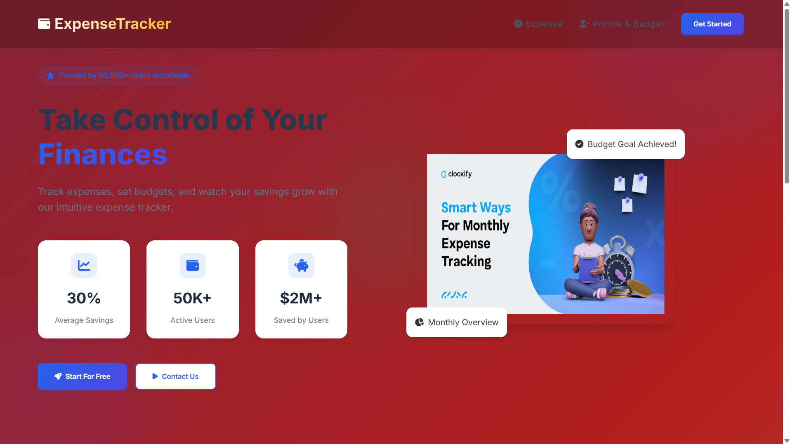
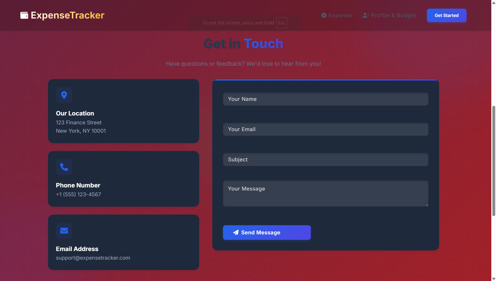
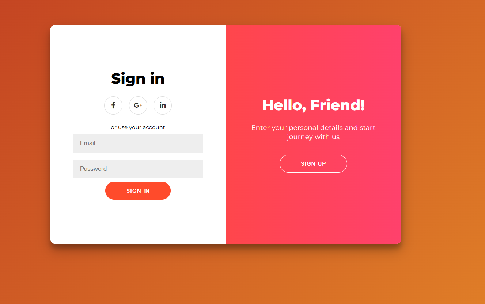
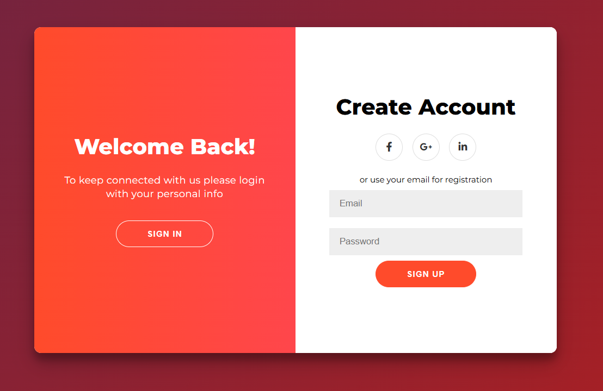
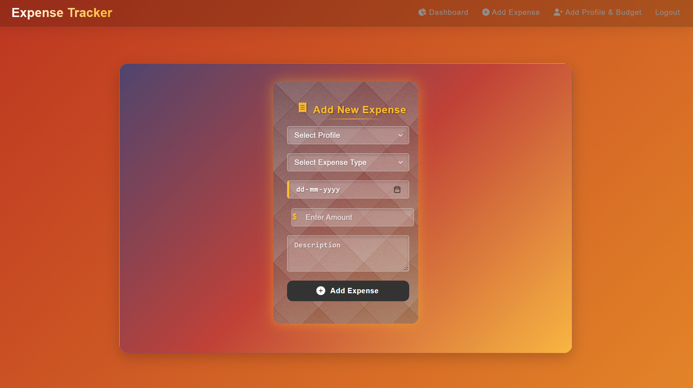
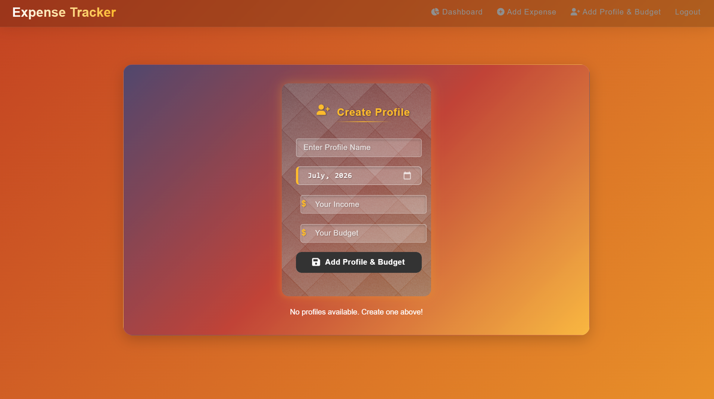
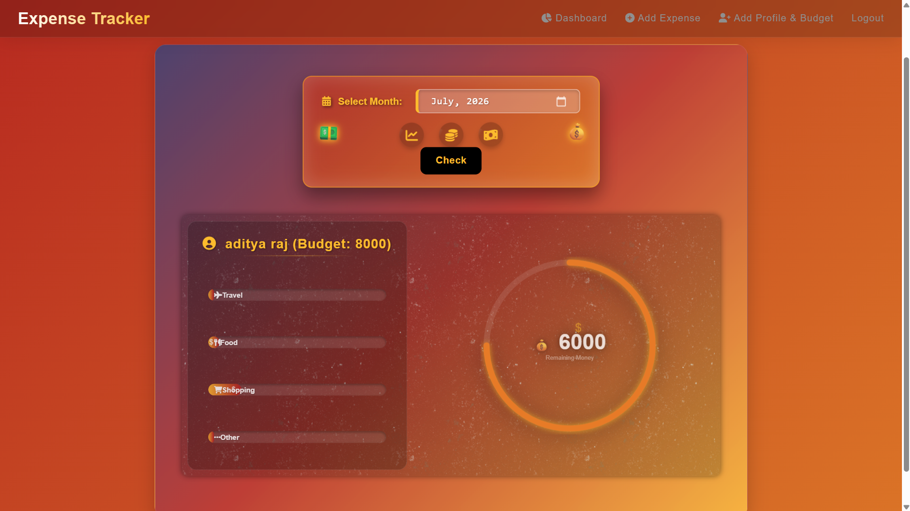

# 👨‍💻 Author

**Name:** Aditya Raj

**Intern ID:** CITS5546

**GitHub:** https://github.com/araj67995

⭐ If you found this project helpful, please consider giving it a **Star** on GitHub!

# 💰 Expense Tracker

A modern and responsive **Expense Tracker Web Application** built with **Node.js, Express.js, MongoDB, EJS, HTML, CSS, and JavaScript**. It helps users manage their monthly budgets, track expenses, analyze spending habits, and monitor remaining savings through interactive dashboards.

---

## 📸 screenshots

### 🏠 Landing Page



### 📞 Contact Page



### 🔐 Login



### 📝 Register



### ➕ Add Expense



### 👤 Create Profile & Budget



### 📊 Dashboard



---

# ✨ Features

- 🔐 User Authentication (Login & Signup)
- 👤 Create Multiple Budget Profiles
- 💰 Monthly Budget Management
- ➕ Add Expenses
- 📅 Monthly Expense Tracking
- 📊 Interactive Dashboard
- 📈 Expense Progress Bars
- 💵 Remaining Budget Calculator
- 📱 Responsive UI
- 🎨 Modern Glassmorphism Design
- ⚡ Fast and Lightweight

---

# 🛠 Tech Stack

### Frontend

- HTML5
- CSS3
- JavaScript
- EJS
- Bootstrap
- Font Awesome

### Backend

- Node.js
- Express.js

### Database

- MongoDB
- Mongoose

---

# 📂 Project Structure

```
ExpenseTracker/
│
├── models/
│   ├── User.js
│   ├── Expense.js
│   └── Profile.js
│
├── routes/
│   ├── auth.js
│   ├── expense.js
│   └── profile.js
│
├── views/
│   ├── home.ejs
│   ├── login.ejs
│   ├── signup.ejs
│   ├── dashboard.ejs
│   ├── expense.ejs
│   └── profile.ejs
│
├── public/
│   ├── css/
│   ├── js/
│   └── images/
    ├── screenshots/
│        ├── home.png
│        ├── contact.png
│        ├── login.png
│        ├── signup.png
│        ├── expense.png
│        ├── profile.png
│        └── dashboard.png
│
├── app.js
├── package.json
└── README.md
```

---

# 🚀 Installation

### Clone Repository

```bash
git clone https://github.com/yourusername/expense-tracker.git
```

Move to project folder

```bash
cd expense-tracker
```

Install dependencies

```bash
npm install
```

Create a `.env` file

```env
PORT=3000

MONGODB_URI=your_mongodb_connection

SESSION_SECRET=your_secret
```

Run Project

```bash
npm start
```

or

```bash
nodemon app.js
```

Open Browser

```
http://localhost:3000
```

---

# 📈 Dashboard Features

- Monthly Budget
- Remaining Budget
- Expense Categories
- Monthly Expense Report
- Budget Progress
- Profile Management

---

# 🔒 Authentication

- User Registration
- User Login
- Session Authentication
- Logout

---

# 💾 Database Collections

## Users

```
Name
Email
Password
```

## Profiles

```
Profile Name
Month
Income
Budget
Remaining Budget
```

## Expenses

```
Profile
Category
Amount
Date
Description
```

---

# 🎯 Future Improvements

- Email Verification
- Forgot Password
- Dark Mode
- Charts (Chart.js)
- Export PDF Reports
- CSV Export
- Expense Filters
- Search Expenses
- Notifications
- Mobile App

---

# 📸 Demo

You can add a GIF or video demo here.

---

# 🤝 Contributing

Contributions are welcome!

1. Fork the repository
2. Create a new branch

```bash
git checkout -b feature-name
```

3. Commit changes

```bash
git commit -m "Added new feature"
```

4. Push

```bash
git push origin feature-name
```

5. Open a Pull Request

---

# 📄 License

This project is licensed under the MIT License.

---

# 👨‍💻 Author

**Aditya Raj**

GitHub: https://github.com/araj67995

---

## ⭐ If you like this project, don't forget to Star the repository!